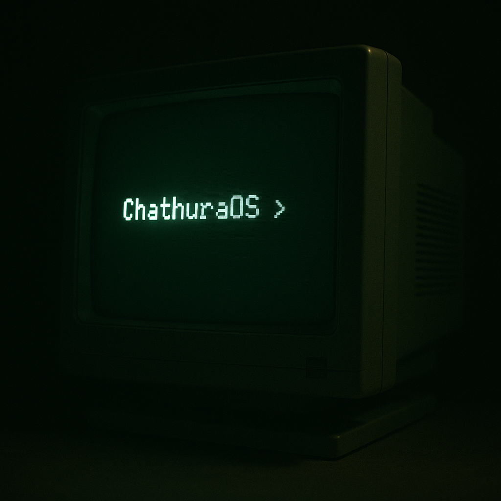

# ChathuraOS

A simple 16-bit Operating System written from scratch in Assembly language for a university project on Computer Architecture and Operating Systems.



---

## Features

- Two-stage bootloader that loads a kernel from a virtual floppy disk.
- Interactive command shell that reads and processes user input.
- **Built-in commands:**
  - `about`: Displays information about the OS and its author.
  - `date`: Shows the current system date from the hardware clock.
  - `time`: Shows the current system time from the hardware clock.
  - `info`: Displays basic hardware information (system memory).
  - `help`: Shows the list of available commands.
  - `clear`: Clears the screen.

## Development Environment

This OS was developed in an Ubuntu environment running inside a VirtualBox virtual machine.

- **Assembler:** NASM (The Netwide Assembler)
- **Emulator:** QEMU

## Building and Running

1.  Ensure you have `nasm` and `qemu-system-x86` installed.
2.  From the project's root directory, run the build script:
    ```bash
    ./build.sh
    ```
3.  This will assemble the source code, create the `chathuraos.img` disk image, and launch it in QEMU.
